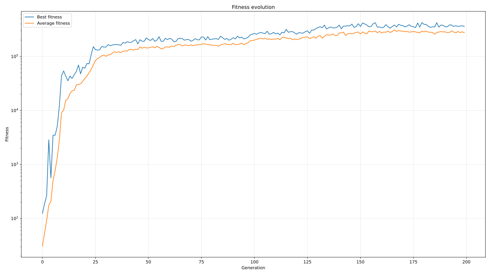
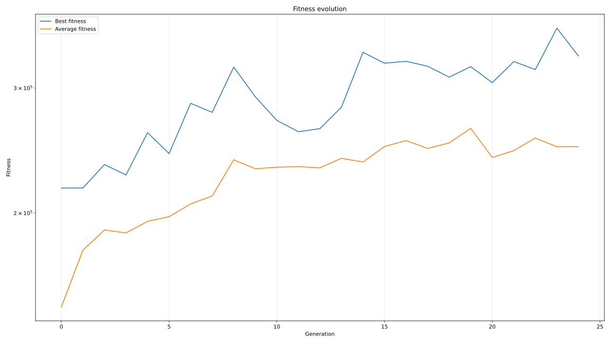

# Genetic Algorithm in Python

## Description

This project aims to test the genetic algorithm method to play games, such as the Snake game. The method will be used to train neural networks.

[snake.webm](https://github.com/user-attachments/assets/d870d68b-49d6-4ca8-86ba-721349757b54)



[game_2048.webm](https://github.com/user-attachments/assets/d00a77d5-37b0-4c44-bbd8-a19435c17a78)



## What is a Genetic Algorithm ?

A genetic algorithm (GA) is a type of evolutionary algorithms inspired by the process of natural selection. Genetic algorithms are commonly used to generate solutions to optimization and search problems via biologically inspired technics: selection, crossover and mutation.

### Methodology

Start from N individuals with randomly generated neurons. For the next generation follow these steps:

- Compute the fitness score, i.e. how well an individual performed to the task, of all individuals of the previous generation.
- Elitism: From the previous generation, keep the K best individuals as is. They will represent 2% of the new generation.
- Tournament Selection: From the previous generation, choose the best individual in a random sample of individuals. They will represent 48% of the new population.
- Crossover and mutation:  From the previous kept individuals, mix their neurons weights randomly and add noise. They will represent 35% of the new population.
- New individuals: create random new individuals. They will represent 15% of the new population.

*The percentages are given for guidance purposes only.*

### Fitness function and rewards

For the population to improve, one needs to define a way to rank individuals of a population. This is done using a fitness function. This function defines rewards and penalties applied to an individual for its actions. Here are examples of rewards and penalties in the case of the Snake game:

- Eating reward: an individual is rewarded for eating an apple
- Winning reward: an individual is rewarded for completing the game
- Avoidance penalty: an individual is penalized for taking an action that made it in danger
- Starvation penalty: an individual is penalized for not eating an apple for too long
- Collision penalty: an individual is penalized for colliding with a wall or its body

## Structure

This project architecture is inspired by the [**Gymnasium**](https://github.com/Farama-Foundation/Gymnasium) library.

- Core: Contains the core element of the project (Environment, GeneticAlgorithm, NeuralNetwork)
- Snake: Contains the snake game logic, a wrapper for training, visualization tools and a script to play the game yourself

## Installation

### Create a virtual environment and activate it

```bash
python -m venv venv
```

On Linux:

```bash
source venv/bin/activate
```

On Windows:

```bash
venv\Scripts\activate.bat
```

### Install libraries

```bash
pip install pygame-ce numpy matplotlib
```

### Install the project in editable mode

```bash
pip install -e .
```

## Libraries

- [**NumPy**](https://github.com/numpy/numpy)
- [**Pygame Community Edition**](https://github.com/pygame-community/pygame-ce/)
- [**Matplotlib**](https://github.com/matplotlib/matplotlib)

## License

This project is under the [**MIT License**](LICENSE.md).
